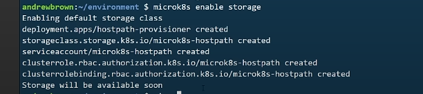
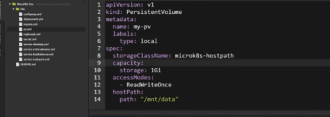
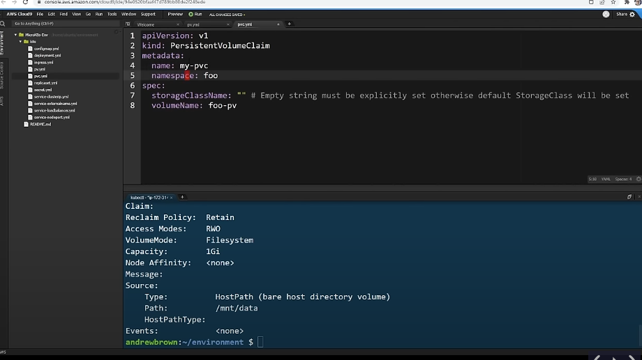
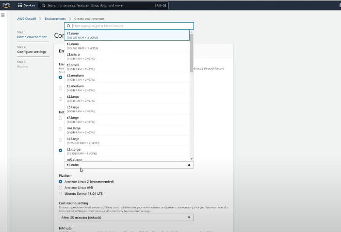
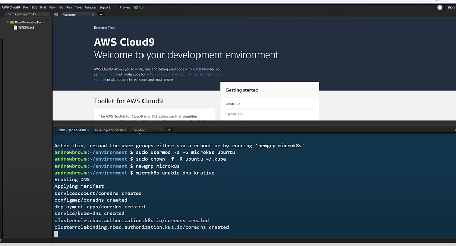

# kubernetes-Associate
Hands-on implementation of kubernetes with andrew brown

# Review of light weight containers

step 1: Building an using docker
 go to aws and tape cloud9 -> environment-> create environment

 # install ruby latest version

 `rvm install 3.1.0`

 `cd / app -> bundle install -> bundle exec ruby server.rb -> docker build . -t sinatra-sample -> docker image`

 `[https://www.codewithjason.com/dockerize-sinatra-application/](https://www.codewithjason.com/dockerize-sinatra-application/)`

```
 => ERROR [4/4] RUN bundle install                                                                                          1.7s
------
 > [4/4] RUN bundle install:
0.408 Warning: the running version of Bundler (2.1.4) is older than the version that created the lockfile (2.5.11). We suggest you to upgrade to the version that created the lockfile by running `gem install bundler:2.5.11`.
0.951 Fetching gem metadata from https://rubygems.org/....
1.528 rack-protection-4.1.1 requires ruby version >= 2.7.8, which is incompatible with
1.528 the current version, ruby 2.7.4p191
------
dockerfile:7
--------------------
   5 |     WORKDIR /code
   6 |     COPY . /code
   7 | >>> RUN bundle install
   8 |     
   9 |     EXPOSE 4567
--------------------
ERROR: failed to solve: process "/bin/sh -c bundle install" did not complete successfully: exit code: 5
@DarrylNnon ➜ /workspaces/kubernetes-Associate/app (3-day-02-k8s) $ gem install bundler:2.5.11
Fetching bundler-2.5.11.gem
Successfully installed bundler-2.5.11
Parsing documentation for bundler-2.5.11
Installing ri documentation for bundler-2.5.11
Done installing documentation for bundler after 0 seconds
1 gem installed

A new release of RubyGems is available: 3.5.11 → 3.6.5!
Run `gem update --system 3.6.5` to update your installation.
```
## update the gem file using the latest version
`gem update --system 3.6.5`

## create a public repository to store our app on aws ECR

```
Push commands for sinatra-sample


macOS / Linux

Windows
Make sure that you have the latest version of the AWS CLI and Docker installed. For more information, see Getting Started with Amazon ECR .
Use the following steps to authenticate and push an image to your repository. For additional registry authentication methods, including the Amazon ECR credential helper, see Registry Authentication .
Retrieve an authentication token and authenticate your Docker client to your registry. Use the AWS CLI:
aws ecr-public get-login-password --region us-east-1 | docker login --username AWS --password-stdin public.ecr.aws/y1k2j8d7
Note: If you receive an error using the AWS CLI, make sure that you have the latest version of the AWS CLI and Docker installed.

Build your Docker image using the following command. For information on building a Docker file from scratch see the instructions here . You can skip this step if your image is already built:
docker build -t sinatra-sample .

After the build completes, tag your image so you can push the image to this repository:
docker tag sinatra-sample:latest public.ecr.aws/y1k2j8d7/sinatra-sample:latest

Run the following command to push this image to your newly created AWS repository:
docker push public.ecr.aws/y1k2j8d7/sinatra-sample:latest
```

## Minikube follow along
- [minikube.install](https://minikube.sigs.k8s.io/docs/start/?arch=%2Flinux%2Fx86-64%2Fstable%2Fbinary+download)

```
- curl -LO https://github.com/kubernetes/minikube/releases/latest/download/minikube-linux-amd64
- sudo install minikube-linux-amd64 /usr/local/bin/minikube && rm minikube-linux-amd64
- minikube start

```

Minikube is use for the testing envionment

to use minikube in gitpod we do:
we install minikube
we install kubectl
we chmod kubectl `chmod u+x kubectl`
we move into the bin file `sudo mv kubectl /usr/local/bin`

# create k8s folder where we create ad eployment.yaml file and paste the deplyoment from this resource:
- [rails-app-deployment-kubernetes](https://www.honeybadger.io/blog/rails-on-kubernetes/)

# to deploy the app in kubernetes we do 
`kubectl apply -f k8s/deployment.yml`
 next to verify the deployment we do: `kubectl get deployments`

 when we run port in kubernetes their are available by default and in order to reach them we have to use aa service wich is going to assign an ip addre on the deployment or ussing a port forwarding
 `kubectl port-forward deployment/sinatra 8080:4567 --address 0.0.0.0 ` after we do a `curl localhost:8080`

 ## kubernetes dashboard
 `step to use it on cloud9 -> stop the cluster (minikube stop)-> minikube start --listen-address='0.0.0.0' we notice that we loose our app wich is find now we are going to do -> kubectl proxy --address='0.0.0.0' --disable-filter=true -> add inbound on secruity group and allow port 8081 for dasboard and copy the ip and add the link provided by the terminal to your browser.`

 ### Day 3:today we're using kind(docker in kubernetes) to practice.

 # installation of kind: [https://kind.sigs.k8s.io/](https://kind.sigs.k8s.io/docs/user/quick-start/#installation)

`# For AMD64 / x86_64
[ $(uname -m) = x86_64 ] && curl -Lo ./kind https://kind.sigs.k8s.io/dl/v0.27.0/kind-linux-amd64
# For ARM64
[ $(uname -m) = aarch64 ] && curl -Lo ./kind https://kind.sigs.k8s.io/dl/v0.27.0/kind-linux-arm64
chmod +x ./kind
sudo mv ./kind /usr/local/bin/kind`

# create kubertes dashboard:[https://kubernetes.io/docs](https://kubernetes.io/docs/tasks/access-application-cluster/web-ui-dashboard/)

```
# Add kubernetes-dashboard repository
helm repo add kubernetes-dashboard https://kubernetes.github.io/dashboard/
# Deploy a Helm Release named "kubernetes-dashboard" using the kubernetes-dashboard chart
helm upgrade --install kubernetes-dashboard kubernetes-dashboard/kubernetes-dashboard --create-namespace --namespace kubernetes-dashboard
```
# delete cluster (kind)
we do `kind delete cluster`

### Microk8s
we will follow these step to install it:
`sudo snap install microk8s --classic`
#check the status
`microk8s status --wait-ready`
#turn on the service i want
`microk8s enable dashboard dns registry istio`

# complete guide
```
To install **MicroK8s** on GitHub Codespaces, follow these steps:  

### **Step 1: Update and Install Dependencies**  
First, update the package list and install necessary dependencies:  
```bash
sudo apt update && sudo apt install -y snapd
```

### **Step 2: Install MicroK8s**  
Now, install MicroK8s using Snap:  
```bash
sudo snap install microk8s --classic
```

### **Step 3: Add User to MicroK8s Group**  
To avoid using `sudo` every time, add your user to the `microk8s` group:  
```bash
sudo usermod -aG microk8s $USER
newgrp microk8s
```

### **Step 4: Verify Installation**  
Check the status of MicroK8s:  
```bash
microk8s status --wait-ready
```

### **Step 5: Enable Essential Add-ons**  
Enable DNS, Storage, and other useful add-ons:  
```bash
microk8s enable dns storage ingress
```

### **Step 6: Use kubectl with MicroK8s**  
Since MicroK8s includes `kubectl`, you can use:  
```bash
microk8s kubectl get nodes
```
Or, create an alias for convenience:  
```bash
alias kubectl="microk8s kubectl"
```

### **Step 7: Deploy a Test Application (Optional)**  
To verify everything is working, deploy an Nginx pod:  
```bash
microk8s kubectl run nginx --image=nginx --port=80
microk8s kubectl get pods
```

```note
$ sIt looks like **GitHub Codespaces** does not support **systemd**, which is required for **Snapd** to function properly. Unfortunately, this means that **MicroK8s cannot be installed on GitHub Codespaces** because it relies on Snap.  

### **Alternative Solutions**  
Since Snap isn't working, you can try these alternative Kubernetes solutions on Codespaces:  

#### **Option 1: Install K3s (Lightweight Kubernetes)**  
K3s is a lightweight Kubernetes distribution that does **not** require Snap. You can install it with:  
```bash
curl -sfL https://get.k3s.io | sh -
```
Then, check if it's running:  
```bash
k3s kubectl get nodes
```

#### **Option 2: Use Kind (Kubernetes in Docker)**  
If you prefer running Kubernetes in Docker, you can install **Kind**:  
```bash
curl -Lo ./kind https://kind.sigs.k8s.io/dl/v0.20.0/kind-linux-amd64
chmod +x ./kind
sudo mv ./kind /usr/local/bin/kind
```
Then, create a cluster:  
```bash
kind create cluster
kubectl get nodes
```


### **Which One Should You Choose?**  
- **If you want a minimal and fast setup → K3s**  
- **If you need a Kubernetes cluster inside Docker → Kind**  

Since **MicroK8s won't work on Codespaces**, I recommend using **K3s or Kind** instead.
```

#enable the dns
`microk8s enable dns`

# to deploy with microk8s we do:
`microk8s kubectl apply -f k8s/deployment.yml`
next we do `microk8s get pod` next `microk8s kubectl get deployment` next `microk8s kubectl get pod`

note we do port-forward to access the ip addres:
`microk8s kubectl port-forward deployments/sinatra 8080:4567 --address 0.0.0.0.0`

curl localhost:8080

# enable dashboard
`microk8s enable dashboard`-> microk8s dashboard-proxy-> copy the token -> open ec2 and edit inbound to allow traffic -> paste ip ec2 + ip dashboard into your browser -> paste the token-> and voila.bingo!

# when the connection to the server local host refused. we do the following `microk8s config > ~/.kube/conf`

# expose pod on communication ip [https://kubernetes.io/docs/tasks/debug/debug-application/debug-service/]
debug service `kubectl run -it --rm --restart=Never busybox --image=gcr.io/google-containers/busybox sh`
we copy the ip address of the running pod and we add wget in front plus the ip address of the open port like this: `wget 10.1.22.12:4567` (this is an example) then we cat to to see the content eg.cat index.html

# Service cluster ip

resources: [https://kubernetes.io](https://kubernetes.io/docs/concepts/services-networking/service/)

we now can use: 
- microk8s kubectl apply -f k8s/service-clusterip.yml
- microk8s kubectl get svc
- microk8s kubectl describe service service-clusterip
- microk8s kubectl patch service service-clusterip -p
delete at the end by doing microk8s kubectl delete svc service-clusterip
- microk8s kubectl get svc

endpoint is the pod link to the service

# kubectl expose 
`microk8s kubectl expose deploy sinatra --port=8080 --target-port=4567`
- microk8s kubectl get svc
- microk8s kubectl delete svc sinatra


]()

# Service ClusterIP
- readinessprobe is determine wether my application is running or not
# create a service
`microk8s kubectl apply -f k8s/service-clusterip.yml`
# we check the service running
`microk8s kubectl get svc`
# we describe the service
`microk8s kubectl describe service service-clusterip`

# service Nodeport
[https://kubernetes.io/](https://kubernetes.io/docs/concepts/services-networking/service/)
```yml
apiVersion: v1
kind: Service
metadata:
  name: my-service
spec:
  selector:
    app.kubernetes.io/name: MyApp
  ports:
     # the port number that the resources within the cluster will use to communicate
    - protocol: TCP
      port: 8080
      targetPort: 4567
      # The external port to connect to the node
      NodePort: 3001```

# We launch our service nodeport
- `microk8s kubectl apply -f k8s/service-nodeport.yml`
- `microk8s kubectl get svc`
- `microk8s kubectl describe svc service-nodeport`
- `curl localhost:3001`
Now we will test our busy box:
`microk8s kubectl run -it --rm --restart=Never busybox --image=gcr.io/google-containers/busybox sh`
Now we do wget 10.152.183.242:8080

# We make sure we delete it after :
`microk8s kubectl delete svc service-nodeport`

# Service Load Balancer

resource: [https://kubernetes.io/](https://kubernetes.io/docs/concepts/services-networking/service/#loadbalancer)
```
apiVersion: v1
kind: Service
metadata:
  name: my-service
spec:
  selector:
    app.kubernetes.io/name: sinatra
  ports:
    - protocol: TCP
      port: 8080
      targetPort: 4567
  clusterIP: 10.0.171.239
  type: LoadBalancer
status:
  loadBalancer:
    ingress:
    - ip: 192.0.2.127
```
`microk8s kubectl apply -f k8s/service-loadbalancer.yml`
- `mirok8s kubectl cluster-info`
-  `microk8s kubectl get nodes`
- `microk8s kubectl api-resources`


## Service externalname (taking a break to rest and start working on it later.thanks)

## Ingress with minikube
- [https://kubernetes.io/](https://kubernetes.io/docs/tasks/access-application-cluster/ingress-minikube/)

- minikube addons enable ingress # to enable the ingress controller
- kubectl get pods -n ingress-nginx
- kubectl create deployment web --image=gcr.io/google-samples/hello-app:1.0 # create a deployment
- kubectl get deployment web  # verify the deployment
- kubectl expose deployment web --type=NodePort --port=8080 # expose the deployment
- kubectl get service web # verify the service

how i expose the port today:
- kubectl apply -f deployment.yml # to deploy
- kubectl expose deploy sinatra --port=8080 --target-port=4567
- kubectl get svc # to see the service
- kubectl apply -f ingress.yml or kubectl create -f ingress.yml
- kubectl get ingress
- kubectl describe ingress
- curl http://localhost/sinatra
to debbug i use busybox:
- kubectl run -it --rm --restart=Never busibox --image=grc.io/google-containers/busibox sh

## jobs we gonna try using cron job here
- kubectl create job hello --image=busybox -- echo "Hello Francklin"
- kubectl describe job

- kubectl create cronjob hello --image=busybox --schedule="*/1 * * * *"
- kubectl get cronjob # to check
- kubectl delete cronjob hello # to delete it


how to start minikube from the docker: 
```sh
minikube start --driver=docker
```

# Replicasets
Replicaset is a way to maintain a desired amount of redundant pods(replicas) to provide a guarantee of availability.

- kubectl apply - replicaset.yml
- kubectl get rs # rs for replicaset
- wkubectl apply -f deployment.yml # to check the status of our deplyoment

# scale and autoscale
auto scale is dynamically adjust the number of pods or nodes based on CPU, memory, or custom metrics to optimize performance and cost.
- mission: is to automate deployment, scaling , and operations of containerized application, ensuring reliability and efficiency

eg: kubectl scale --replicas=4 deploy/sinatra 
deployment.apps/sinatra scaled

- kubectl get deploy
- kubectl get pods

for horizontal autoscaler i can do:
- eg:  kubectl autoscale deploy sinatra  --cpu-percent=50 --min=2 --max=10
- kubectl get hpa # to check auscale 
- kubectl edit hpa sinatra # this will open a vim format where we can edit our horizontalpodautoscaler
-  kubectl delete hpa sinatra # to delete 

# Configmap

Configmap stores configuration data as key-value pairs, allowing applications to be configured dynamically without container images.

Mission: Configmap decouple configuration from application code, enabling better portability, flexibility, and environment-specific settings management.

for today we do:

```sh
docker build -t sinatra-example .
```
- kubectl apply -f configmap.yml
- kubectl get configmap

## Secrets

A secret is an object used to store and manage sensitive information, such as passwords, API keys, SSH keys, and OAuth tokens.

- kubectl apply -f secrets.yml
- kubectl get secrets
- kubectl describe sinatra-basic-auth
- kubectl get secret sinatra-basic-auth -o jsonpath='{.data}'
- run kubernetes dashboard to viiw components
- to run kubernetes dashboard on microk8s i do : microk8s kubectl kube-proxy

## PV and PVC
i do 
```sh
microk8s kubectl enable storage
```


- kubectl get sc


- kubectl get pv
- kubectl describe pv
# create a pvc 



## deployment with storage
- kubectl apply -f deployment-w-storage.yml
- kubectl get pods
- kubectl describe

i always has to have  pvc to manage persistent storage for my application. PVC and PV are used for decoupling storage from pods.kubernetes pods are ephemeral. Separation of storage.

### NetPolicy

- microk8s enable cilium
- kubectl namespace fire or kubectl ns fire
- kubectl create deploy fire-nginx --image=nginx -n fire
- kubectl create deploy ice-nginx --image=nginx -n ice
- kubectl create deploy wind-nginx --image=nginx -n wind
- kubectl get pods -n ice -o wide
- kubectl get deploy -A
- kubectl -n ice <pod> --curl <fire>
- kubectl -n ice ice-nginx-65jtjthgk-wjfh56 -- curl 10.0.0.204
  
  


# create a new environment on cloud9



# Knative
Knative is a platform-agnostic solution for running serverless deployments.

[https://knative.dev/](https://knative.dev/docs/getting-started/)

