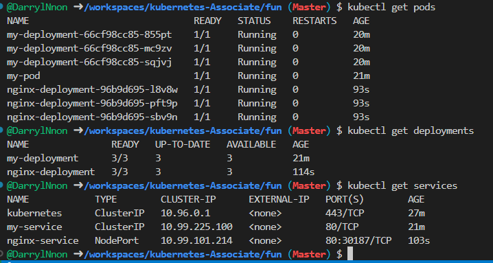
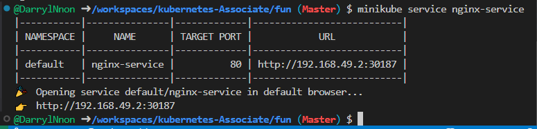

Hands-on: Create a kubernetes Deployment for a Simple App

In this exercise, we'll create a Kubernetes Deployment for a simple Nginx web server. This deployment will include:

Deployment: To manage replicas of the application.
Service: To expose the application to the cluster.

# Deployment file explanation

Explanation:
replicas: The number of Pod instances to run (3 in this case).
selector: Matches Pods with the app: nginx label.
containers: Specifies the container image (nginx:latest) and exposes port 80.

# Service file explanation

Explanation:
selector: Selects Pods labeled app: nginx.
ports:
port: Exposed port for external access.
targetPort: The port inside the container.
type: NodePort makes the service accessible via the cluster node's IP and a random high port.

# Deploy resources

Apply the Deployment:

"kubectl apply -f nginx-deployment.yaml"


Apply the Service:

"kubectl apply -f nginx-service.yaml"

# Verify Deployment

Check Pods:

```sh
kubectl get pods
kubectl get deployments
kubectl get services
```



# Access the App

if using Minikube, use this command to access the service:

```sh
minikube service nginx-service
```

