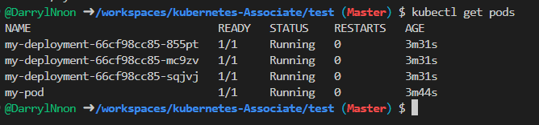
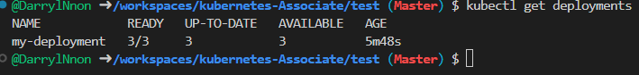
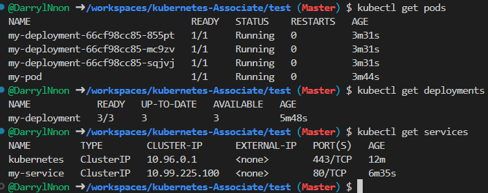

# create and apply the yaml files
pod, deployment, service

# Apply them

```sh
kubectl apply -f pod.yml
kubectl apply -f deployment.yml
kubectl apply -f service.yml
```

# check the resources

```sh
kubectl apply -f pod.yml
```



```sh
kubectl apply get deployments
```



```sh
kubectl get services
```

